Terminal based intercepting proxy written in rust with `tmux` and `vim` as user
interface.

<!-- TABLE OF CONTENTS -->
<details>
  <summary><b>Table of Contents</b></summary>
  <ol>
    <li><a href="#about-the-project">About The Project</a></li>
    <li><a href="#Features">Features</a></li>
    <li><a href="#prerequisites">Prerequisites</a></li>
    <li><a href="#installation">Installation</a></li>
    <ul>
        <li><a href="#make">Make</a></li>
        <li><a href="#manual-installation">Manual Installation</a></li>
        <li><a href="#Add-CA">Add CA</a></li>
    </ul>
    <li><a href="#usage">Usage</a></li>
    <ul>
        <li><a href="#options">Options</a></li>
    </ul>
    <li><a href="#windows">Windows</a></li>
    <ul>
        <li><a href="#interceptor">Interceptor</a></li>
        <li><a href="#history">History</a></li>
        <li><a href="#repeater">Repeater</a></li>
        <li><a href="#addons">Addons</a></li>
        <ul>
            <li><a href="#add-new-addons">Add new addons</a></li>
        </ul>
    </ul>
    <li><a href="#file-types">Filetypes</a></li>
        <ul>
            <li><a href="#his-http-history">his</a></li>
            <ul>
                <li><a href="#conceal">conceal</a></li>
            </ul>
            <li><a href="#req-http-request">req</a></li>
            <ul>
                <li><a href="#variables">Variables</a></li>
                <li><a href="#extended-attributes">Extended Attributes</a></li>
            </ul>
            <li><a href="#res-http-response">res</a></li>
            <li><a href="#whis-all-websocket-history">whis</a></li>
            <li><a href="#wsess-single-websocket-session-history">wsess</a></li>
            <li><a href="#wreq-websocket-request">wreq</a></li>
            <li><a href="#popup-popup-window">popup</a></li>
        </ul>
    <li><a href="#search">Search</a></li>
    <li><a href="#encoding-and-decoding">Encoding and Decoding</a></li>
    <li><a href="#configuration">Configuration</a></li>
    <ul>
        <li><a href="#tmux-config">Tmux Config</a></li>
        <li><a href="#zxc-config">Zxc Config</a></li>
        <ul>
            <li><a href="#global">Global Config</a></li>
            <li><a href="#local">Local Config</a></li>
            <ul>
                <li><a href="#edit-local-config">Edit Local Config</a></li>
            </ul>
        </ul>
        <li><a href="#vim-config">Vim Config</a></li>
    </ul>
    <li><a href="#highlight-groups">Highlight Groups</a></li>
    <li><a href="#logging">Logging</a></li>
    <li><a href="#debugging">Debugging</a></li>
    <li><a href="#roadmap">Roadmap</a></li>
    <li><a href="#contributing">Contributing</a></li>
    <li><a href="#social">Social</a></li>
  </ol>
</details>

<a id="screenshots"></a>
<details>
<summary><b>Screenshots</b></summary>
  <h3>Interceptor </h3>
  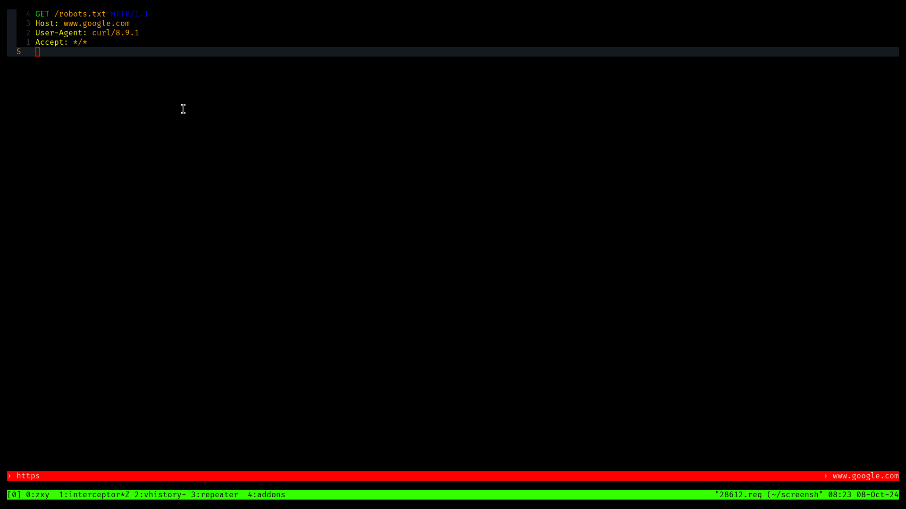
  <h3>Interceptor Showq</h3>
  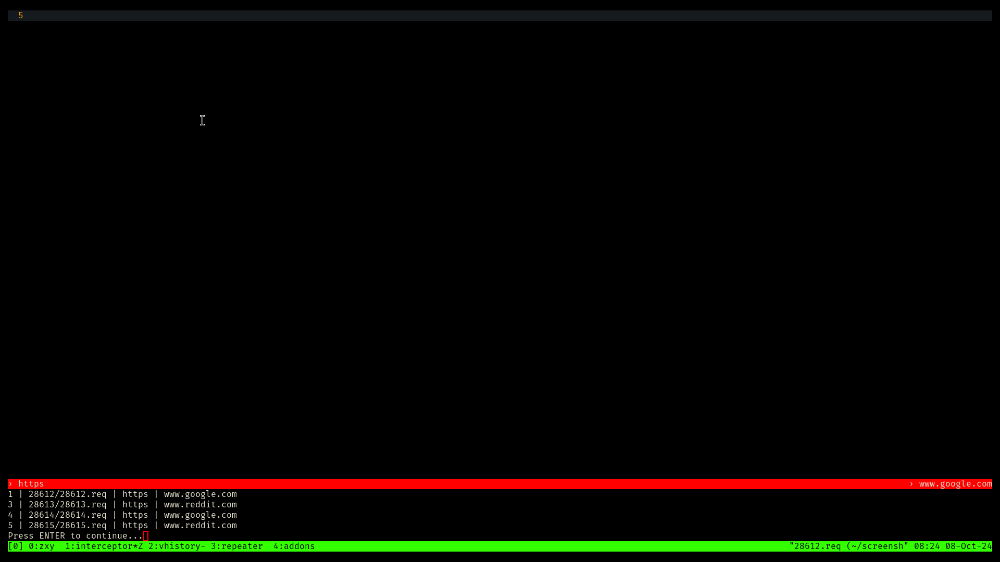
  <h3>History with 100k+ entries</h3>
  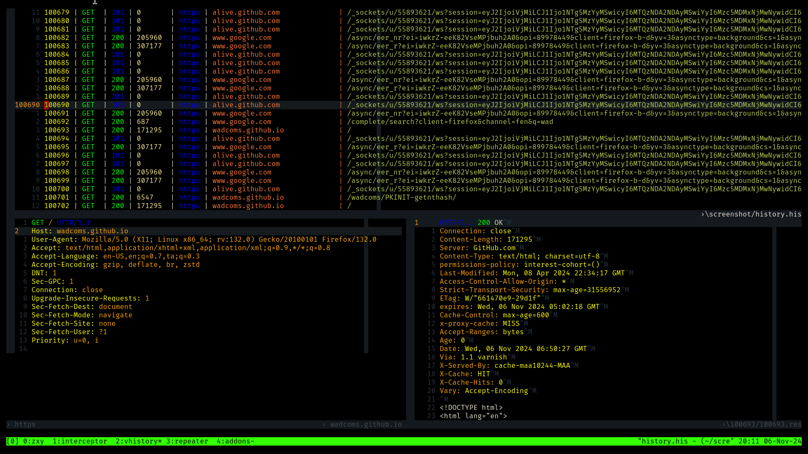
  <h3>History edit host scope</h3>
  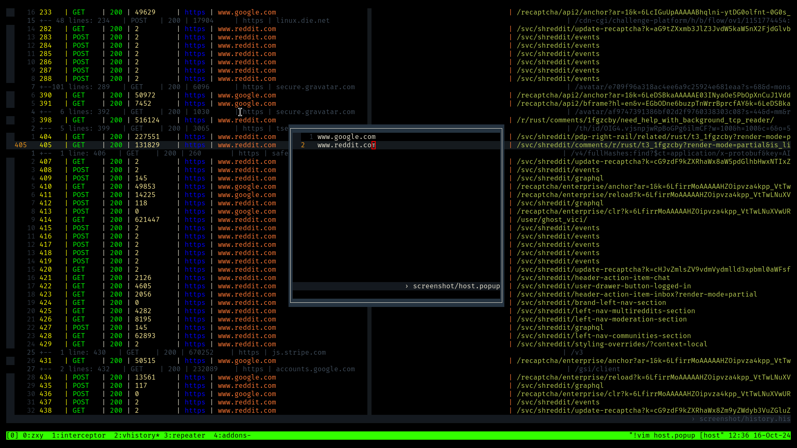
  <h3>History edit status code scope</h3>
  
  <h3>History edit uri scope</h3>
  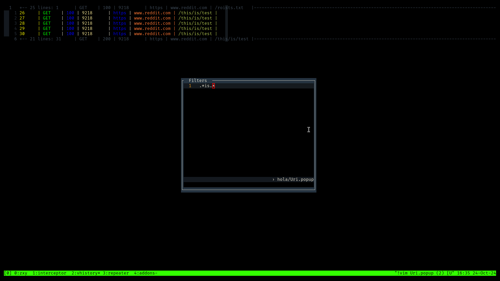
  <h3>History show host scope</h3>
  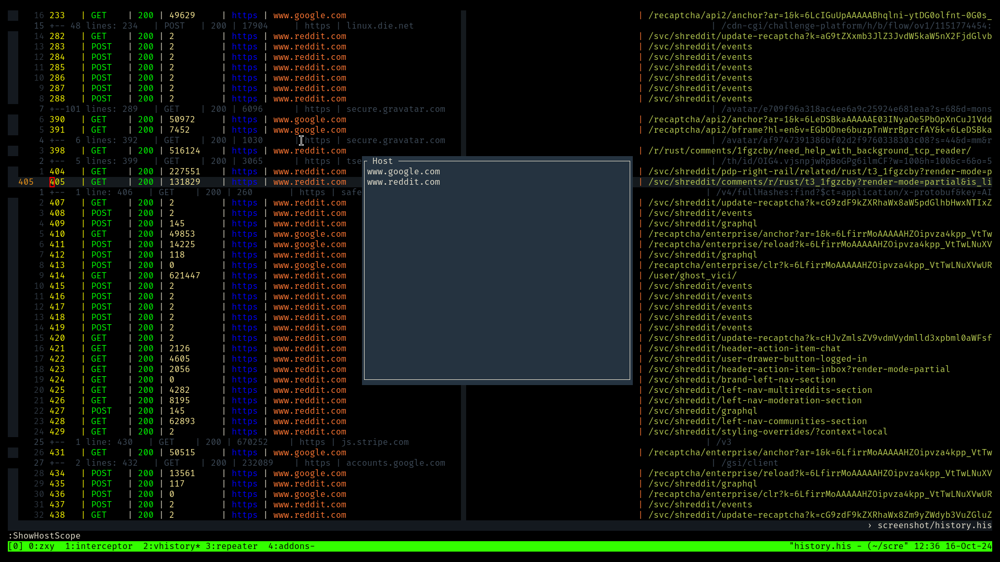
  <h3>History show status code scope</h3>
  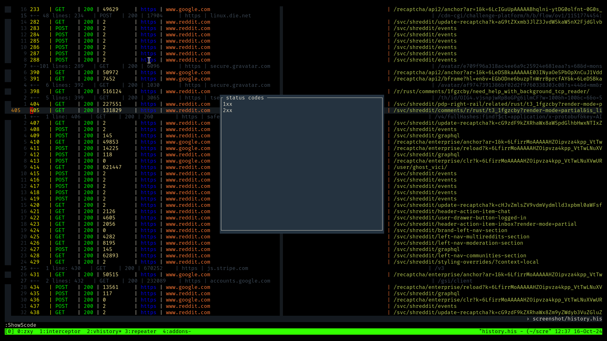
  <h3>History show uri scope</h3>
  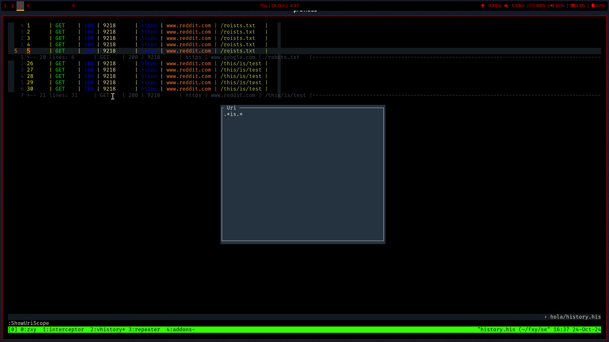
  <h3>History show filters</h3>
  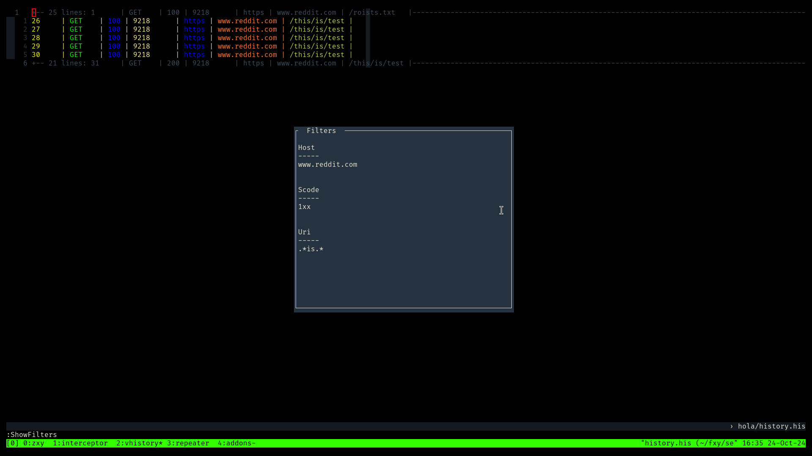
  <h3>History apply filters</h3>
  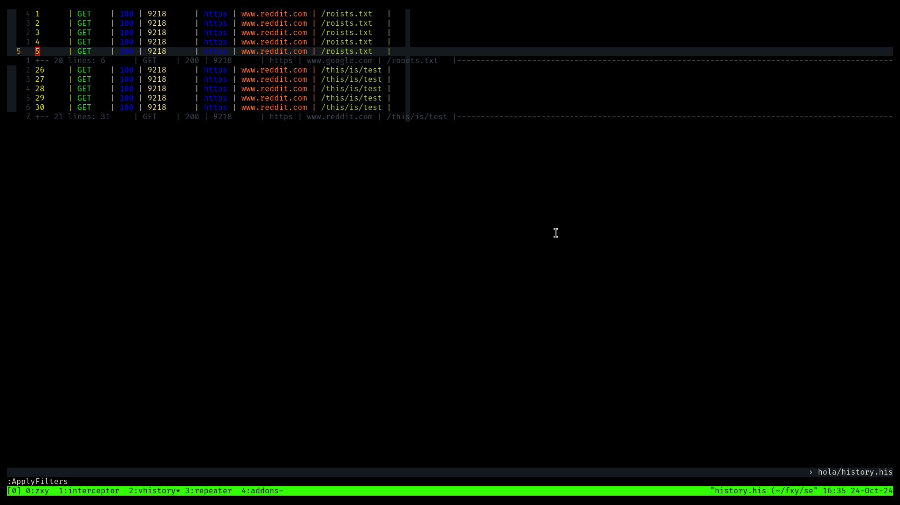
  <h3>Repeater </h3>
  
  <h3>Repeater websocket</h3>
  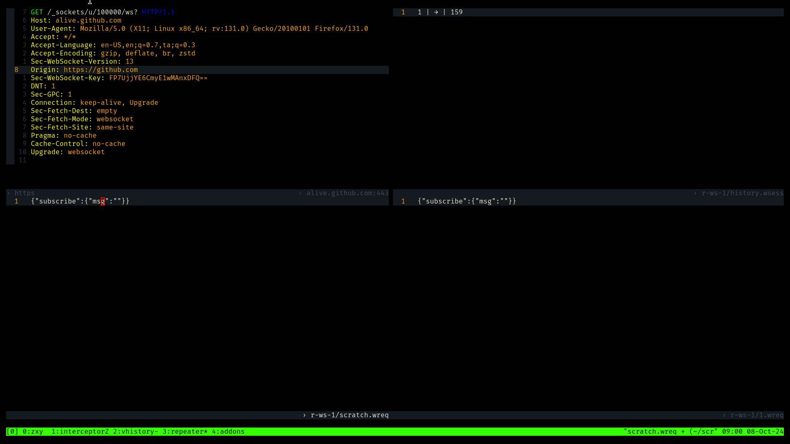
  <h3>Addons - ffuf</h3>
  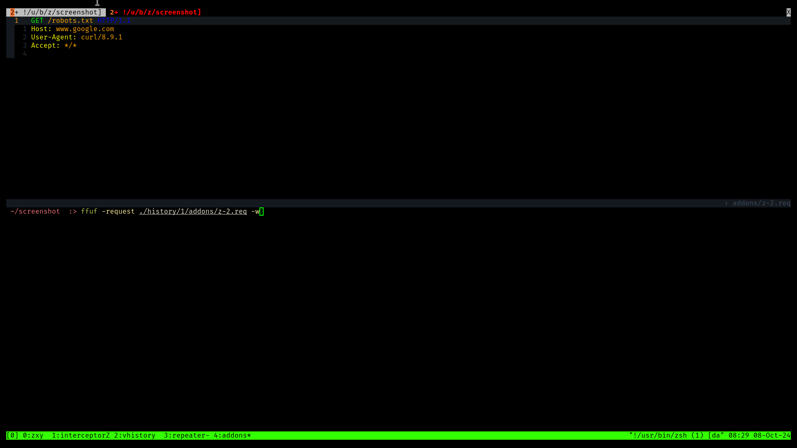
  <h3>Addons - sqlmap</h3>
  
  <h3>Edit buffer variables</h3>
  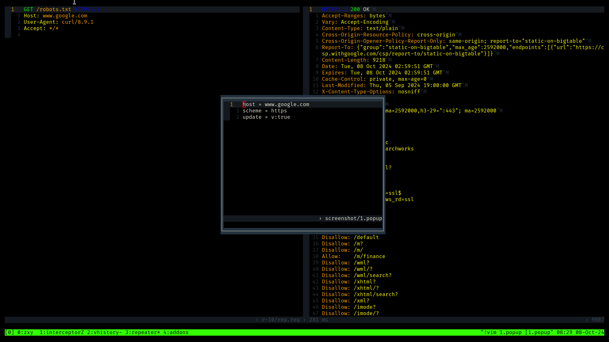
  <h3>Edit Local Config in popup</h3>
  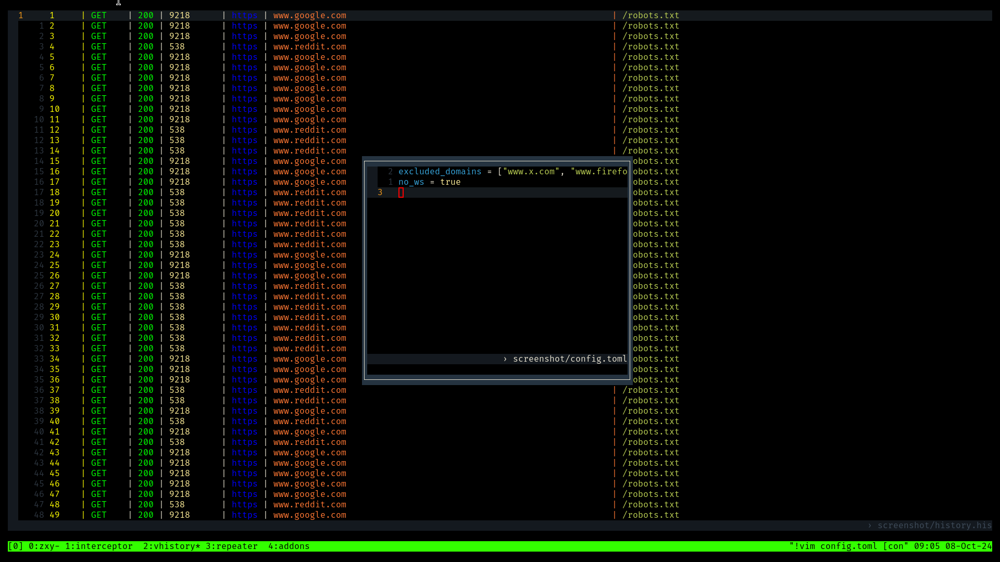
  <h3>Log</h3>
  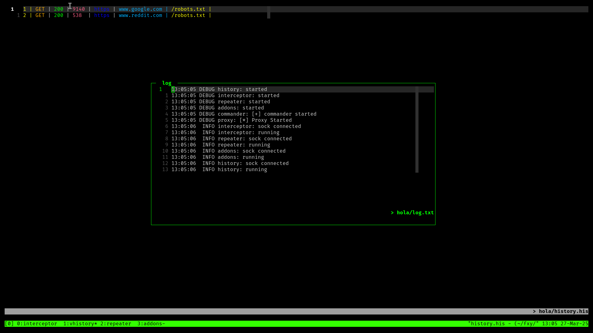
</details>


## About The Project
The tool requires ![zxc.vim][zxc.vim] vim plugin which enables vim to function
as a user interface. Each window and filetype has its own set of keybindings
and commands.

The following windows are present in zxc:
* [Interceptor](#interceptor)
* [History](#history)
* [Repeater](#repeater)
* [Addons](#addons)

When <b>zxc</b> is called a list of bash ![alias][alias] is used to spawn vim
with specific window name which loads corresponding vim config. All windows are
vim instances which communicate with <b>zxc</b> binary via unixsocket channel.

Alias       | Window
:-----------|:---------
interceptor | Interceptor
vhistory    | History
repeater    | Repeater
addons      | Addons

The windows (except history which halts recording) can be closed and reopened
using their respective aliases.
```
                        ┌─────────────┐
       ┌───────────────►│  zxc binary │◄────┬───────────────┐
       │                └┬────────────┘     │               │
       │                 │                  │               │
       │                 │    unix socket   │               │
       │                 │                  │               │
┌──────▼──────┐   ┌──────▼──────┐   ┌───────▼─────┐   ┌─────▼──────┐
│ Interceptor │   │   History   │   │   Repeater  │   │  Addons    │
└─────────────┘   └─────────────┘   └─────────────┘   └────────────┘
```

## Features
* tmux and vim as user interface.
* Disk based storage.
* Custom http/1.1 parser to send malformed requests.
* http/1.1 and websocket support.

## Prerequisites
* getfattr
* tmux
* vim (> 8.2.4684) with the following features
  - channel
  - terminal
  - timers
* ffuf
* sqlmap
* column (optional for indenting history files)

### Packages
```
attr tmux vim ffuf sqlmap bsdmainutils
```

## Installation
### Requirements
* cargo msrv 1.85.1
* make
* openssl

#### Packages
```
make openssl
```

### Make
```
make
```
copy the `zxc` binary from ./target/release to $PATH. Install [vim
plugin](#vim-plugin).

### Manual Installation
1. Copy config files
```
mkdir $HOME/.config/zxc
cp ./config/{alias,config.toml,tmux.conf} $HOME/.config/zxc
```
2. Generate private key
```
openssl genrsa -out $HOME/.config/zxc/private.key 2048
```
3. Generate CA certificate using ./mkscripts/CA.cnf as CA config.
```
openssl req -x509 -new -nodes -key $HOME/.config/zxc/private.key -sha256 -days 1024 -out $HOME/.config/zxc/zxca.crt -extensions v3_req -config ./mkscripts/CA.cnf
```
4. Copy vim config
```
mkdir -p $HOME/.vim/plugin
cp ./config/example/zxc.vim $HOME/.vim/plugin
```
5. Copy filetype plugins (optional)
```
cp -r ./config/example/ftplugin $HOME/.vim
```
6. Build zxc or download from release.
```
cargo b --release
```
### vim plugin
Install [zxc.vim][zxc.vim] plugin.
```
mkdir -p $HOME/.vim/pack/git-plugins/start/
git clone --depth 1 https://github.com/hail-hydrant/zxc.vim $HOME/.vim/pack/git-plugins/start/zxc.vim
```

#### Add CA
Add CA certificate from `$HOME/.config/zxc/zxca.crt` to your trusted CA
or browser.

## Usage
```
zxc
```

### Options
```
  -n, --new-name <NEW_NAME>         Session name to create
  -a, --attach <ATTACH_NAME>        Attach to existing session
  -p, --port <PORT>                 Proxy port to use [default: 8080]
  -i, --include <INCLUDED_DOMAINS>  List of domains to proxy
  -e, --exclude <EXCLUDED_DOMAINS>  List of domains to relay
      --no-ws                       Relay ws connections
  -d, --debug                       Debug mode
  -h, --help                        Print help
```

`-i` and `-e` are mutually exclusive . The values should be in format
`domain:port`.

For example, to intercept all domains except https://<i></i>example.com,
```
zxc -e example.com:443
```

The flags also support wildcard. For example, to intercept all sub domains of
http://*.example.com
```
zxc -i *.example.com:80
```

The domains can be comma separated list of values.
```
zxc -i example.com:80,example.com:443
```

## Windows
### Interceptor
Displays intercepted requests and responses. Each request or response is added
as buffer.

Command             | Description
:---------          | :---------
InterToggle         | Toggle Interception
InterForward        | Forward current request/response
InterForwardAll     | Forward all requests and responses in queue
InterForwardWithRes | Forward Request + Intercept Response
Showq               | Show interception queue with their respective scheme and host
DropMsg             | Drop current request/response

### History
Displays the following history files,
* http history ([his](#his-http-history))
* all websocket history ([whis](#whis-all-websocket-history)) 
* single websocket session history ([wsess](#wsess-single-websocket-session-history)) 

Performs history recording. Closing it halts recording. In case of closing the
window accidentally reopen it by calling `vhistory` to resume recording. If zxc
is existed without history window, a state file `.history.state` is created to
resume logging the next time zxc is attached to this session. 

#### Note
Window is non modifiable and read only.

### Repeater
Repeater window is used to repeat requests. The original request is copied to a
folder named `r-$id` for http and `r-ws-$id` for websocket within the
specific history folder.

Command             | Description                       | Availability
:---------          | :---------                        | :---------
RepeaterSend        | Send Request                      | `.req` and `scratch.wreq`
WsEstablish         | Establish Websocket Connection    | `.req` in ws repeater

To repeat a websocket request,
1. In a websocket request (`wreq`) file, call `WsSendToRepeater`.
2. In repeater window, http request corresponding to the websocket handshake is
   displayed in top-left.
3. Call `WsEstablish` in the request(`req`) window to establish a websocket connection.
4. Write the data in `scratch.wreq` in bottom left and call `RepeaterSend` to
   send.

### Addons
Addons window is used to run additional tools. The original request is copied
to a folder named `addons/$addon_prefix-$id.req` within the specific history
folder with prefix specific to the addon being called. The request is displayed
in the top window and a terminal with addon cmd and arguments is displayed in
bottom split. Currently, `ffuf` and `sqlmap` are available.

#### Add New Addons
Refer to ![global config][config.toml] for example addon integration.
##### 1. Defining addon
Define a new table in `$HOME/.config/zxc/config.toml` file.<br>
The following values(strings) are required:

Key             | Description
:---------      | :---------
name            | Name of the binary to be called
prefix          | Prefix for resulting file used by the addon
request_flag    | Flag used by the addon to identify the request file<br>For example, `-r` for sqlmap and `-request` for ffuf</br>
http_flag       | Flag used by the addon to identify http scheme<br>For example, `-request-proto http` for ffuf</br>
https_flag      | Flag used by the addon to identify https scheme<br>For example, `--force-tls` for sqlmap</br>
add_flag        | Additional flags that will be added to the end of the command

### Note
If the binary by default uses https, skip http_flag and vice versa.

##### 2. Calling Addon
The addon can be called from request `.req` file by calling `RequestToAddon`
function

    call RequestToAddon("addon_name")

Calling from history `.his` file, by calling `HistoryToAddon` function

    call HistoryToAddon("addon_name")

##### 3. Define Addon Command
Add command or keymap via the ftplugin for `req` and `his`.

Example Command
for `.req`

    command RequestToAddon_Name :call RequestToAddon("addon_name")

For `.his`

    command HistoryToAddon_Name :call HistoryToAddon("addon_name")

Example Keymap
for `.req`

    nnoremap <silent> <Leader>q :call RequestToAddon("addon_name")

For `.his`

    nnoremap <silent> <Leader>q :call HistoryToAddon("addon_name")

## File Types
The following file types are available in zxc.

### his [http history]
Command                 | Description
:---------              | :---------
HistoryView             | View highlighted history<br>Default keybinding is `<CR>`
HistoryIndent           | Indent history
HistoryToRepeater       | Send to Repeater
HistoryToFuzz           | Send to Ffuf addon
HistoryToSql            | Send to Sqlmap addon
ApplyFilters            | Apply filters
ShowFilters             | Show filters in popup<br>Use `q` to close popup
ClearFilters            | Clear all filters
AddToHostScope          | Add host in current line to view scope
ClearHostScope          | Clear host view scope list
EditHostScope           | Edit host scope in popup<br>Supports Vim Regex<br>To match as regex add prefix `/r `
ShowHostScope           | Show host scope in popup<br>Use `q` to close popup
AddScode <scode>        | Add Command argument to status code scope<br>Use 'x' in place of wildcard<br>Example,<br>&emsp;&emsp;1xx : shows status code in range 100 - 199<br>&emsp;&emsp;21x : shows status code in range 210 - 219
ClearScode              | Clear status code scope
EditScode               | Edit status code scope in popup
ShowScode               | Show status code scope in popup<br>Use `q` to close popup
AddToUriScope           | Add uri in current line to view scope
ClearUriScope           | Clear uri view scope list
EditUriScope            | Edit uri scope in a popup<br>Supports Vim Regex<br>To match as regex add prefix `/r `
ShowUriScope            | Show uri scope list in a popup
EditConfig              | Edit local config in popup <br>If the config is modified then reloaded automatically</br>
ReloadConfig            | Manually Reload config
ConcealUri              | Conceal URI column

### Note
- Vim fold is used to apply filters. Use `zR` to open all folds.

- The `HistoryIndent` command uses the `column` shell command and can be
  resource intensive on large files. Use sparingly.

- HostScope and UriScope support vim regex. Prefix the entry with `/r ` to
  match as regex. For example to match all subdomains of google.com, `/r
.*.google.com`

#### Conceal
For `his` filetype, the URI can be concealed. Set `g:conceal` variable in
`.his` ftplugin to the number of characters to be concealed. Set the
`conceallevel` in your vimrc to enable this feature.

### req [http request]
Command             | Description
:---------          | :---------
EditBufVar          | Edit buffer variables in a popup<br>available in `interceptor` and `repeater` windows only</br>
RequestToFuzz       | Send to Ffuf addon
RequestToRepeater   | Send to Repeater
RequestToSql        | Send to Sqlmap addon

#### Variables
`req` filetype has specific set of variables which can be modified to customize
request handling. `EditBufVar` command can be used to edit buffer variables in
a popup. Save and quit popup to reflect changes. The following variables are
available in `interceptor` and `repeater` windows.

Variable    | Type          | Description
:---------  | :--------     | :---------
b:host      | string        | Host to send request to (ignore port for scheme specific default)
b:scheme    | string        | http/https
b:sni       | string        | SNI to use in TLS handshake (only when b:scheme is https)
b:update    | bool          | Whether request should be updated according to RFC.

#### Extended Attributes
The following extended attributes are set to the `.req` filetype for users to
identify the destination for a request outside of zxc.

Value       | Description
:---------  | :----------
user.host   | Host to which request was sent (ignore port for scheme specific default)
user.http   | Set to "1" when scheme is http.<br>for https, ignored.
user.sni    | Set when scheme is https and host != sni

### res [http response]
Only variable `b:update` available.

### whis [All websocket history]
Command             | Description
:---------          | :---------
ViewWsHistory       | View highlighted ws flow.<br>Default binding is `<CR>`.</br>

### wsess [Single websocket session history]
Command             | Description
:---------          | :---------
ViewWsSessionHistory| View highlighted ws req/res in split.<br>Default binding is `<CR>`.</br>

### wreq [websocket request]
Binary Frames are indicated by 'b' in right corner of status line.

Command             | Description
:---------          | :---------
WsSendToRepeater    | Send ws request to Repeater

### popup [popup window]
The popup window can be customised by setting `g:popup_options` with vim's
`popup_create-arguments` option in users `zxc.vim` file.

### Additional Filetypes
FileType            | Description
:---------          | :---------
wres                | websocket response
popup               | popup window

## Search
The following commands search and fill their respective lists.
Quickfix-list   | Location-list     | Filetypes searched
:------         | :----------       | :----------
Greq            | LGreq             | `.req`
Gres            | LGres             | `.res`
Greb            | LGreb             | both `.req` and `.res`

## Encoding and Decoding
The following commands are available in `VISUAL` mode for encoding and decoding
in `interceptor` and `repeater` windows.

Command             | Description
:------             | :---------
EBase64             | Base64 encode
DBase64             | Base64 decode
EUrl                | URL encode
DUrl                | URL decode
EUrlAll             | URL encode all characters
DUrlAll             | URL decode all characters

### Note
register x is used to store the selected text.

## Configuration
### tmux config
![tmux.conf][tmux.conf] is used to set up session aliases. In addition it
sources user's tmux.conf file from
1. $HOME/.tmux.conf
2. $HOME/.config/tmux/tmux.conf
3. $XDG_CONFIG_HOME/tmux/tmux.conf

If the tmux.conf is in custom location add the location to zxc's tmux.conf file
in `$HOME/.config/zxc/tmux.conf`
```
source-file /path/to/tmux.conf
```

### zxc config
There are two types of config files, Global and per session local config. Local
config is given preference over global config.

#### Global
Global Config file is located in `$HOME/.config/zxc/config.toml`. Default
![global config][config.toml]

Keys                    | Description                               | Possible Values
:---------              | :---------                                | :---------
excluded_domains        | List of domains to be relayed             | string list
excluded_content_types  | List of content types to be relayed       | list of:<br> app, audio, font, img, msg,<br>model, multipart, txt, video
excluded_extensions     | List of extensions to be relayed          | string list
with_ws                 | Whether to proxy websocket requests       | bool (default true)

#### Local
Per session config is created in `$session/config.toml` based on user flags.
Only if any flag is used, local config is created. Example ![local
config][local_config.toml].

Keys                | Description                           | Possible Values
:---------          | :---------                            | :---------
included_domains    | List of domains to proxy              | string list
excluded_domains    | List of domains to relay              | string list
no_ws               | Whether to relay websocket requests   | bool (default false)

### Note
Include and exclude lists are mutually exclusive. If both lists are present
Include list is given preference. Supports wildcard.

##### Edit Local Config
`EditConfig` command in history window will open local config file in a popup
window. On quitting the window if the file is modified the configuration will be
reloaded automatically. If the file is edited outside of history window, call
`ReloadConfig` in history window.

### Vim Config
Each window and filetype has its own set of commands. Filetypes can be
configured in their respective ftplugin. The commands are further explained in
`:h zxc.txt`.

The following global variables are available
Variables           | Description
:--------           | :----------
g:popup_options     | Options passed to vim's `popup_create-arguments`.
g:timeout           | The time to wait for a response from zxc when blocking.<br>Default 5000 ms

Example ftplugin links
Link                | For
:---------          | :---------
[zxc][example-zxc]  | interceptor, repeater, Addons, Encoding, Decoding
[his][example-his]  | `his` filetype.
[req][example-req]  | `req` filetype.

## Highlight Groups
Each filetype has its own set of highlight groups. Use `:h
zxc-highlight-groups` to list available highlight groups. A gist of available
highlight groups can be found [here][zxcolor].

FileType            | Highlight Group Help
:---------          | :---------
history             | zxc-hl-his
req                 | zxc-hl-req
res                 | zxc-hl-res

## Logging
The log is written to `$session/log.txt`. The log can be viewed in tmux popup
using tmux command `zxcl` or `bind-key e` shortcut.

### Note
By default, tmux command-alias of index 1000 is used to store the command. In
case of conflict change the index to some unassigned value in
`$HOME/.config/zxc/tmux.conf`.

## Debugging
Run zxc with `-d` flag to enable debugging. The proxy debug info from binary is
written to `$session/log/proxy.log`. The channel log for each window is written
to `$session/log/$window_chan.log`. The windows have the following debug
commands.

Command         | Description
:---------      | :---------
PrintDebug      | Prints debug info
WriteDebug      | Writes debug info to a file named $window_debug.log in $session/log directory

## Roadmap
* Configuration based host redirection.
* Follow redirects in repeater.
* Nvim support.
* Socks support.
* http/2 and http/3 support.

## Contributing
Feel free to report issues and PR's. Feature requests are most welcome.

## Social
[][bluesky]
[][reddit]
[][x]


[BUILD_VIM]: https://github.com/vim/vim/blob/master/src/INSTALL
[alias]: https://github.com/hail-hydrant/zxc/blob/main/config/alias
[config.toml]: https://github.com/hail-hydrant/zxc/blob/main/config/config.toml
[example-his]: https://github.com/hail-hydrant/zxc/blob/main/config/example/ftplugin/his.vim
[example-req]: https://github.com/hail-hydrant/zxc/blob/main/config/example/ftplugin/req.vim
[example-wreq]: https://github.com/hail-hydrant/zxc/blob/main/config/example/ftplugin/wreq.vim
[example-zxc]: https://github.com/hail-hydrant/zxc/blob/main/config/example/zxc.vim
[local_config.toml]: https://github.com/hail-hydrant/zxc/blob/main/config/example/local_config.toml
[tmux.conf]: https://github.com/hail-hydrant/zxc/blob/main/config/tmux.conf
[zxc.vim]: https://github.com/hail-hydrant/zxc.vim
[zxcolor]: https://github.com/hail-hydrant/zxc/blob/main/config/example/zxcolor.vim
[bluesky]: https://bsky.app/profile/zxc-proxy.bsky.social
[reddit]: https://www.reddit.com/r/zxc_proxy/
[x]: https://x.com/zxc_proxy
